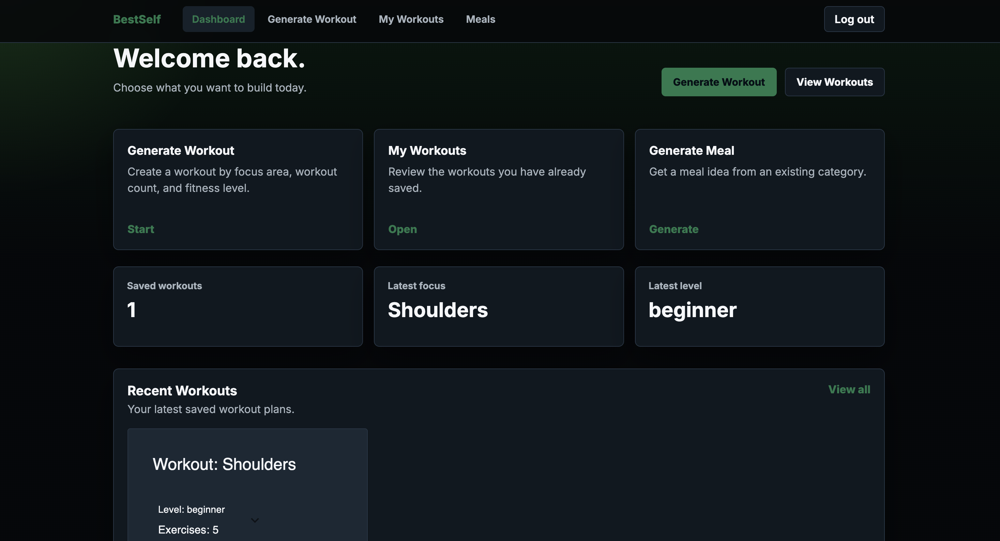
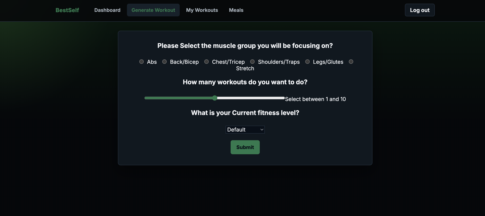
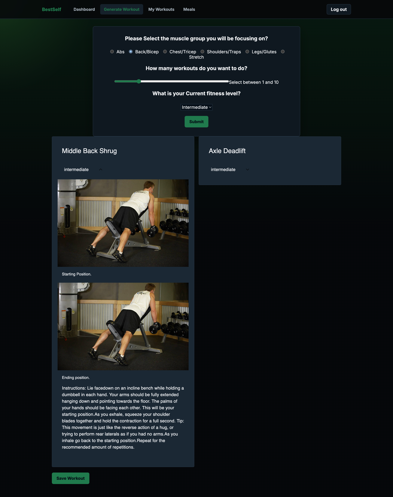
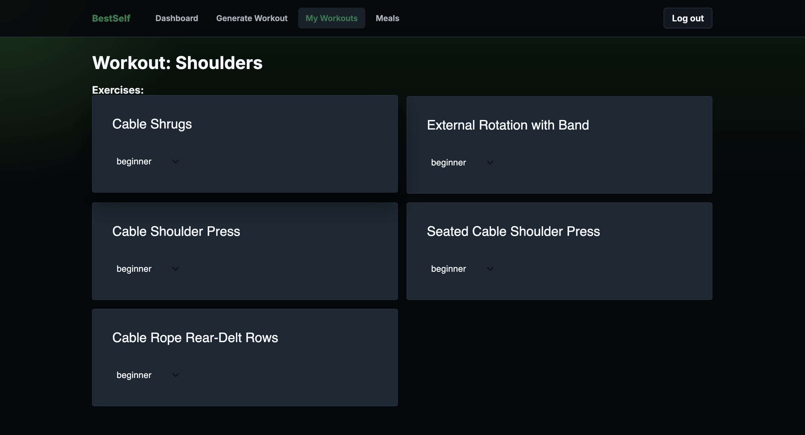
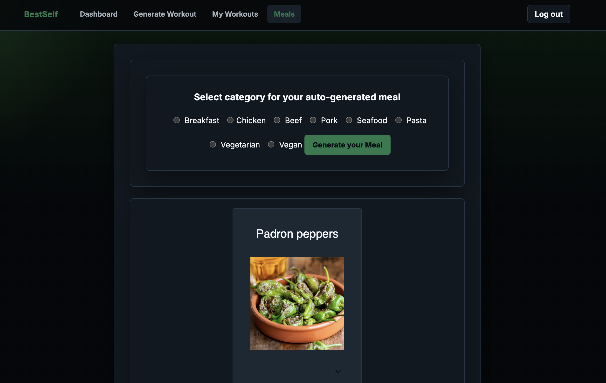

# BestSelf — Fitness & Meal Generation System

BestSelf is a full-stack fitness and meal generation application built using the Next.js App Router architecture. The platform dynamically generates structured workout routines and meal recommendations based on user-selected parameters through modular UI systems and API-driven generation logic.

The application emphasizes scalable frontend architecture, reusable component systems, backend persistence, and organized user workflows while maintaining a clean and responsive dashboard-based interface.

---

## Live Demo

https://bestself-fitness-generator.vercel.app

---

## Demo Instructions

1. Create an account or log in
2. Navigate to "Generate Workout"
3. Select a muscle group, workout count, and fitness level
4. Generate and save a workout plan
5. View saved plans through the dashboard and "My Workouts" page
6. Explore meal generation through the Meals tab

---

# Application Screenshots

## Dashboard

Centralized dashboard displaying workout statistics, saved plans, and application navigation through a consistent UI system.



---

## Workout Generator

Generate workouts dynamically based on selected focus areas, workout count, and difficulty level.



---

## Workout Details

Detailed workout breakdowns with expandable exercise instructions and organized training information.



---

## Saved Workouts

Workout persistence system powered through authenticated user accounts and MongoDB integration.



---

## Meal Generation

Meal recommendation system utilizing reusable card-based UI components and responsive layouts.



---

# 🚀 Core Features

## 🏋️ Workout Generation

- Filter by muscle group and body focus
- Select workout intensity level
- Choose workout count and frequency
- Dynamic workout generation based on user-defined parameters
- Expandable exercise detail rendering

## 💾 Saved Workout System

- Save generated workouts to user accounts
- Persistent workout storage using MongoDB
- Dashboard integration for saved workout management
- Individual workout detail pages

## 🍽 Meal Generation

- Category filtering (seafood, chicken, beef, breakfast, lunch, dinner)
- Structured meal data modeling
- Randomized selection within defined constraints
- Responsive meal rendering system

## 📊 Dashboard Interface

- Centralized application navigation
- Dynamic user-specific rendering
- Workout statistics and summary cards
- Reusable component-driven layouts

## 🔐 Authentication & Persistence

- User authentication with NextAuth
- Protected user-specific workflows
- Database persistence with MongoDB and Mongoose

---

# 🧠 Architecture Overview

BestSelf is built using the Next.js App Router and leverages API route handlers located within `app/api/` to manage workout and meal generation logic.

The system applies rule-based filtering and randomized selection logic through modular components and server-side route handlers to produce tailored fitness and nutrition outputs within defined constraints.

The architecture emphasizes:

- modularity,
- scalability,
- separation of concerns,
- maintainability,
- and reusable frontend systems.

---

## Application Structure

- `app/` — App Router structure
- `app/api/` — Server-side route handlers
- `components/` — Reusable UI components
- `screenshots/` — README project screenshots
- Modular UI architecture
- Separation of business logic and presentation
- Parameter validation and controlled randomization

---

# 🛠 Tech Stack

## Frontend

- Next.js (App Router)
- React
- JavaScript
- Material UI
- CSS

## Backend

- Next.js API Routes
- MongoDB
- Mongoose
- NextAuth

## Deployment

- Vercel

---

# ⚙️ Engineering Concepts Demonstrated

- Full-stack application architecture
- REST API integration
- Authentication workflows
- CRUD operations
- Database persistence
- Dynamic rendering and state management
- Rule-based generation systems
- Reusable component systems
- Responsive dashboard design
- Modular frontend architecture
- Separation of concerns
- Parameterized filtering systems

---

# 📦 Installation

## Clone Repository

```bash
git clone https://github.com/romanedorrel/bestself-fitness-generator.git
```

## Navigate Into Project

```bash
cd bestself-fitness-generator
```

## Install Dependencies

```bash
npm install
```

## Run Development Server

```bash
npm run dev
```

Then visit:

```txt
http://localhost:3000
```

---

# 📈 Future Improvements

- Workout completion tracking
- Expanded meal planning system
- Progress analytics dashboard
- Search and filtering functionality
- Enhanced mobile responsiveness
- Improved loading states and animations
- User profile customization
- Calendar and scheduling integrations

---

# 🎯 Purpose

BestSelf was created as a portfolio-focused full-stack application designed to strengthen experience with frontend architecture, backend integration, authentication systems, database persistence, and scalable UI development within the Next.js ecosystem.

The project emphasizes building connected application systems rather than isolated pages while focusing on maintainable structure and real-world workflow design.

---

# Author

Romane Dorrel

GitHub:
https://github.com/romanedorrel

Live Application:
https://bestself-fitness-generator.vercel.app
